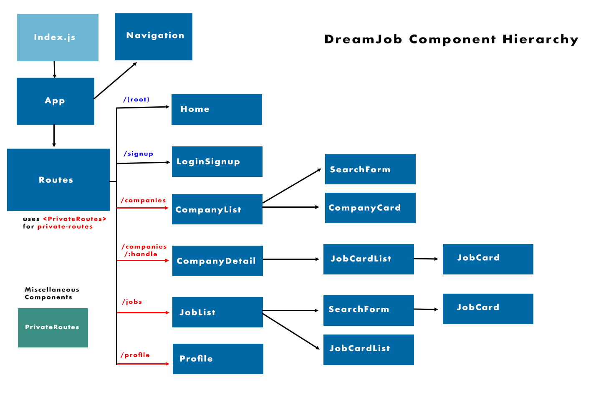

# DreamJob

DreamJob is a full stack job application made with React.js on the frontend and features Express.js and PostgreSQL on the backend.
[Live Demo](http://dreamjob.demo.ericjho.com/)

### Technologies 
- React.js
- Express.js
- PostgreSQL
- Node.js

### Features
- Login/Logout -> authorization and authentication middleware to protect private routes
- Edit Profile
- Search Companies & Jobs: browse and search hiring companies and view the jobs posted by each company
- Sign up
- Apply for posted jobs

# DreamJob Component Hierarchy

# Getting Started on the Server

1. Clone the repository
2. `cd server`
3. `npm install`
4. `createdb jobly`
4. `createdb jobly-test`
5. `psql jobly < data.sql`
6. `npm start`
7. `npm test` to run the tests

# Getting Started on the Client

1. `cd ../client`
2. `npm install`
3. `npm start`
4. `npm test` to run the tests

## Note

* The [deployed version of this app](http://dreamjob.demo.ericjho.com/) uses the backend written by Rithm School (this was so that students could start with the same codebase when building out the React frontend). I do have a version of the [backend](https://github.com/Inhockorea/express-jobly) separately.

